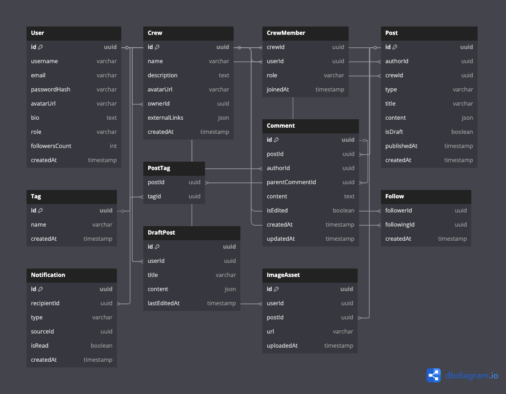

# Folks-Backend

## [ERD](https://dbdiagram.io/d/folksfashioncommunity-680a46a51ca52373f537a8de)

## 사용 기술

| 기술           | 선택 이유                                               |
| -------------- | ------------------------------------------------------- |
| **DB**         | PostgreSQL (ORM/Prisma와 호환성 높음)                   |
| **ORM**        | Prisma (타입 안전성, DX, Nest와 잘 어울림)              |
| **NestJS**     | 모듈 기반, 테스트하기 쉽고 규모 커져도 유지 쉬움        |
| **Swagger**    | REST 문서화 자동화 (`@nestjs/swagger`)                  |
| **Validation** | `class-validator` + `class-transformer`로 DTO 검증      |
| **Auth**       | `Passport.js` + JWT (검증된 안정성 및 다량의 샘플 존재) |

# 진행 상황

## ⚙️ 기본 인프라/보일러플레이트

- [x] Prisma + NestJS 연동
- [x] 환경 구성 (Docker, PostgreSQL, Prisma)
- [x] E2E 테스트 기초 구성
- [x] 환경 변수 및 설정 분리 (@nestjs/config)
- [x] GlobalExceptionFilter 적용

## 회원가입/로그인

- [x] 이메일 + 비밀번호 기반 회원가입 및 로그인 구현
- [x] 비밀번호 암호화 (bcrypt)
- [x] JWT 발급 및 인증 로직 구현
- [x] JwtGuard 적용
- [x] 본인계정 CRUD(/me)
- [x] 인증된 유저만 접근 가능한 API 예제 작성

## 📝 게시글 작성/조회

- [x] Post 모델 정의
- [x] 게시글 타입 필드 (TALK, COLUMN, CREW 등)
- [x] ProseMirror 기반 에디터 연동 (저장 구조 고민 필요) -> 임시 JSON 선택
- [x] 임시저장 기능 (isDraft)
- [ ] 게시글 CRUD API 🏃
- [ ] 게시글 목록/상세 API

## 🎪 CREW 페이지 생성/조회

- [x] Influencer 등급 로직 설계 (우선은 수동 지정으로 시작 가능)
- [x] Crew 모델 정의 및 연동
- [x] 크루 페이지 생성/조회 API

## 🧑‍💼 유저 프로필 페이지

- [ ] 내가 쓴 글, 좋아요, 팔로우 등 모델 정리
- [ ] 유저 정보 수정 API 확장 (소개글, 이미지 등)

## 💬 댓글 기능

- [ ] 댓글/대댓글 모델 설계
- [ ] 댓글 CRUD API

## 🎨 기본 UI/UX

- folks/front-end에서 진행 예정
  - PageTransition 시스템 연동 (프론트단)
  - 반응형 대응 및 Tailwind 기반 디자인 시스템
