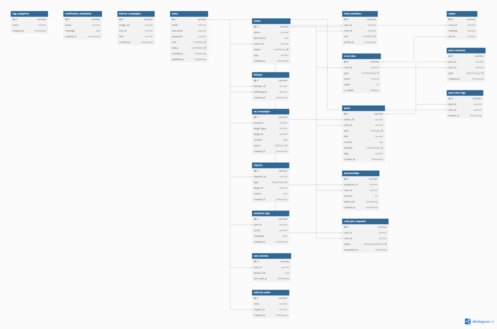

# Folks-Backend

## [ERD](https://dbdiagram.io/d/folksfashioncommunity-680a46a51ca52373f537a8de)

| 기술       | 선택 이유                                                                 |
|------------|--------------------------------------------------------------------------|
| **DB**     | PostgreSQL (ORM/Prisma와 호환성 높음)                              |
| **ORM**    | Prisma (타입 안전성, DX, Nest와 잘 어울림)                             |
| **NestJS** | 모듈 기반, 테스트하기 쉽고 규모 커져도 유지 쉬움                        |
| **Swagger**| REST 문서화 자동화 (`@nestjs/swagger`)                                   |
| **Validation** | `class-validator` + `class-transformer`로 DTO 검증                    |
| **Auth**   | `Passport.js` + JWT (검증된 안정성 및 다량의 샘플 존재)                        |
